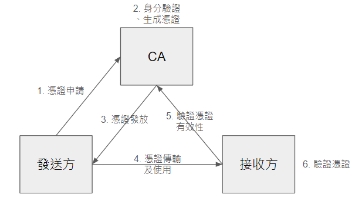
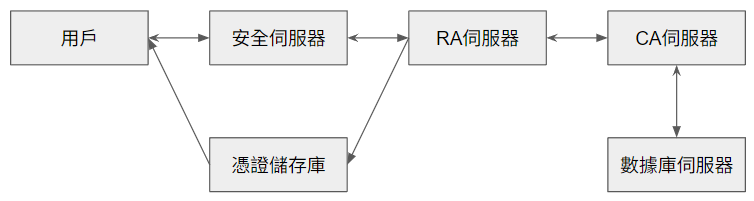
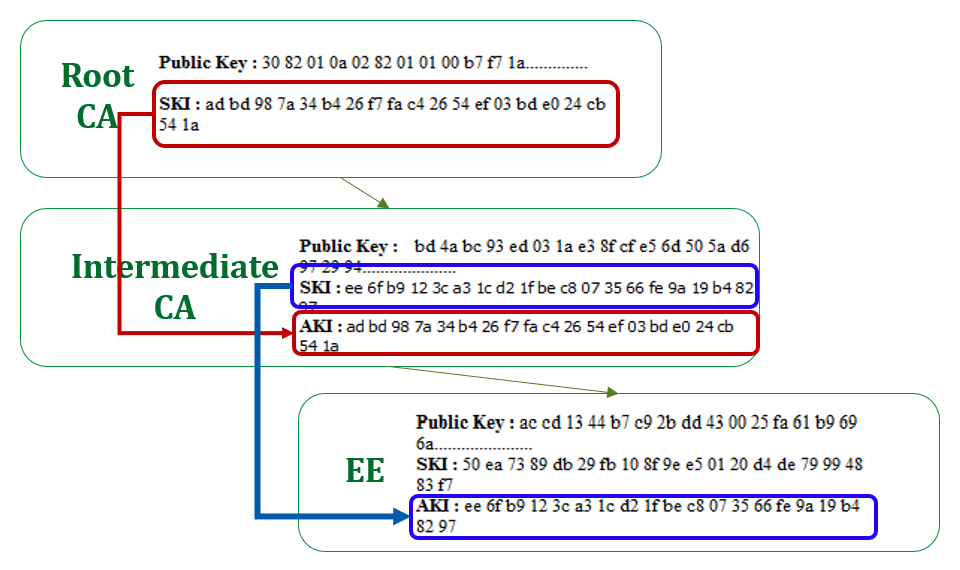

# CA（Certificate Authority）

## 簡介

CA，數位憑證認證機構，是負責發放、管理數位憑證的權威機關，作為受信任的第三方，承擔公鑰體系中公鑰的合法性檢驗的責任。

## 數位簽章（Digital Signature）

又稱公鑰數位簽章，使用了公鑰加密領域的技術，定義兩種互補的運算，一個用於簽章，另一個用於驗證，用於確保數位通信或文件的完整性和不可否認性。
使用的技術為非對稱加密（如RSA、ECDSA）及雜湊函數（如SHA-256）。

### 數位簽章的生成：

發送者對於要傳輸的訊息原文使用雜湊函式生成雜湊值，然後使用自己（發送者）的私鑰對雜湊值進行加密（又稱簽署），得到的結果即為數位簽章。

### 數位簽章的驗證：

數位簽章和訊息原文一同傳輸給接收方，接收方使用發送方的公鑰解密還原雜湊值（下方路徑），並對訊息原文經過雜湊函式計算出雜湊值（上方路徑）。接收方比對兩份雜湊值是否相同，可以保證訊息的完整性和不可否認性。

完整性：意味著接收者可以確認消息在傳輸過程中沒有被更改。由於雜湊函式有雪崩效應的性質，如果兩份雜湊值相符，則證明消息未被篡改。

不可否認性：確保發送者無法否認曾發送過該消息。由於私鑰只有發送者擁有，如果簽章驗證成功，就證明訊息確實來自擁有對應私鑰的發送者。

> 問：數位簽章要發揮作用，首先需要接收方獲取發送方的公鑰。那麼要如何確保所獲取的公鑰是發送方的公鑰，而不是假冒的呢？
答：數位憑證提供了發布公鑰的簡便方法，能夠將公鑰和實際身份之間建立可靠的連結。
> 

> 問：我還是不懂，只有對應的私鑰加密的資料才能用公鑰解密，那發送者就用對應的私鑰去加密資料，證明了發送者本身有這個私鑰，不就證明了對應的公鑰是發送者的。為什麼還需要憑證呢？
答：數位簽章只證明了您擁有對應的公私鑰，但無法證明您就是您聲稱的那個人或實體。換句話說，如果沒有數位憑證，每個人都可以產生公私鑰對，去冒充其他目標實體。
> 

## 數位憑證（Digital Certificate）

又稱公開金鑰認證（Public key certificate）或身分憑證（Identity certificate），數位憑證是用於公開金鑰基礎建設（PKI）的電子檔案，用來將特定的公鑰與宣稱的身分關聯起來。它提供了一種機制，使依賴方能夠驗證公鑰確實屬於宣稱的實體，從而建立對該實體身分的信任。

> 注意：它不是直接「證明」身分的「真實性」，而是提供了一個可信的關聯。
> 

以上為證書的申請、發布、使用的簡單示意圖

看起來很複雜，簡單來說，就是把數位簽章的訊息原文，換成發送方公鑰、身分資訊、有效期等資訊，公私鑰改為使用受信任的CA的，就是數位憑證的生成和驗證過程。

### 數位憑證的生成：

CA收到數位憑證申請，並驗證申請者的真實身分後，把申請者的公鑰、身分資訊、數位憑證的有效期等訊息打包在一起，使用雜湊函式生成雜湊值。最後，CA使用自己的私鑰對這個雜湊值進行簽署，生成數位簽章。

數位簽章與原始資訊（申請者的公鑰、身分資訊、數位憑證的有效期等）一起組成完整的數位憑證。

### 數位憑證的驗證：

接收方收到數位憑證後，首先提取憑證中的數位簽章，使用CA的公鑰對數位簽章進行驗證，獲得原始雜湊值。同時，對憑證中的其他內容（公鑰、身分資訊、有效期等，不包括簽章）進行雜湊獲得新的雜湊值，比對兩個雜湊值：

- 如果相同，證明憑證的內容未被篡改（完整性）
- 同時也證明憑證確實由聲稱的CA簽發（認證性）

額外步驟：檢查憑證的有效期，並查詢憑證是否被吊銷。

## 完整的PKI/CA系統

- 安全伺服器：安全伺服器面向一般使用者，用於提供憑證申請、瀏覽、憑證廢止清單、憑證下載等安全服務；使用者需要首先取得安全伺服器的憑證（該憑證由CA核發）。
- RA伺服器：RA為註冊中心，在CA架構中扮演承上啟下的角色，一方面向CA轉發安全伺服器傳輸來的憑證申請要求，另一方面向憑證儲存庫和安全伺服器轉發CA核發的數位憑證和憑證廢止清單（CRL）。
- 憑證儲存庫：提供目錄瀏覽服務，負責將註冊中心伺服器RA傳輸來的使用者資訊以及數位憑證加入到伺服器上。使用者可以直接透過存取憑證儲存庫取得其他使用者的公開數位憑證、最新的憑證撤銷清單（CRL）。
- CA伺服器：整個憑證機構的核心，負責憑證的簽發。CA首先產生自身的私鑰和公鑰，然後生成數位憑證，並且將數位憑證傳輸給安全伺服器。CA還負責為安全伺服器、RA伺服器生成數位憑證。
- 資料庫伺服器：CA中的核心部分，需要高度安全性，用於儲存和管理各種重要資訊，包括：所有已簽發的數位憑證、使用者資訊、金鑰資訊（如CA的公鑰）、日誌、統計資訊、憑證狀態資訊（如是否已撤銷）。

> 問：為什麼使用安全伺服器而不直接與RA溝通？
答：安全伺服器作為一個額外的安全層，可以過濾和防禦潛在的攻擊，處理大量的用戶請求，保護RA和CA系統的同時，也可以確保RA專注於核心任務。
> 

> 問：CA的私鑰呢？
答：CA的私鑰是整個PKI系統中最敏感、最重要的資訊之一，通常會採用特殊的硬體安全模組（Hardware Security Module, HSM）來存儲和使用私鑰。
> 

### 憑證申請過程：

1. 使用者申請：使用者與安全伺服器建立連線；產生自己的公鑰和私鑰，將公鑰和自己的身分資訊提交給安全伺服器，安全伺服器將使用者的申請資訊傳送給RA伺服器。
2. RA審核：RA收到使用者的申請，使用者向RA證明自己的身分，RA進行核對。如果RA同意使用者的請求，則對憑證申請資訊做數位簽章；否則拒絕使用者的申請。
3. CA核發憑證：RA將使用者的申請內容和RA簽章傳輸給CA，CA對RA數位簽章做認證，如果驗證通過，則同意使用者請求，核發使用者憑證，然後將使用者憑證輸出。如果驗證不通過，則拒絕使用者憑證申請。
4. RA轉發憑證：RA從CA得到新的憑證，首先將憑證輸出到憑證儲存庫，再通知使用者憑證核發成功，告知憑證序號，到指定的網址去驗證憑證。
5. 使用者憑證取得：使用者使用憑證序號去指定網址驗證自己的數位憑證，只有持有與申請時提交的公鑰配對的私鑰才能驗證成功。
    
    > 問：憑證不是公開的嗎，為什麼要持有私鑰才能驗證？
    答：為了確保憑證確實與申請者相關聯，防止了中間人攻擊或身份冒用，憑證的初始驗證過程是受限制的。此後，任何人都可以自由存取和下載這個憑證。
    > 

### 憑證撤銷過程：

1. 使用者申請：使用者向RA發送一封簽章加密郵件，申請撤銷憑證。
2. RA審核：RA同意憑證撤銷後，RA使用其私鑰對撤銷申請進行數位簽章
3. CA更新：
    - CA驗證憑證撤銷請求的RA簽章，如果正確則同意申請，更新內部資料庫，同時更新CRL和OCSP響應者的資訊。
4. 資訊發布：
    - RA收到更新確認，將新CRL發布到憑證儲存庫。
    - OCSP響應者即時更新，準備回應狀態查詢。
5. 使用者和系統存取：
    - 使用者可以存取憑證儲存庫下載CRL。
    - 支援OCSP的系統可以即時查詢OCSP響應者獲取憑證狀態。

> 問：私鑰遺失的話該如何撤銷呢？
答：多數CA和RA會有預先設定的備用身份驗證程序（電話、視訊等實名認證），專門用於處理私鑰遺失的情況。可能包括安全問題、密碼或其他預先設定的識別資訊。
> 

> 問：什麼是OCSP響應者呢？
答：OCSP響應者（OCSP Responder）是PKI系統中的一個重要組件，負責處理OCSP（Online Certificate Status Protocol，線上憑證狀態協定）請求。能夠即時提供憑證的狀態信息（有效、已撤銷、未知），比CRL更快速。
雖然CRL可能會很大，導致檢查過程較慢，但是OCSP需防止DDoS。
> 

> 問：回到了最一開始的問題，使用者使用數位簽章，但還是需要數位憑證去確保他是本人。
那麼CA使用數位簽章，我們該如何確認他是聲稱的CA呢？
答：這個問題的解決方案主要依賴於信任錨和信任鏈的概念，以下進行說明。
> 

## PKI（公開金鑰基礎設施）中的憑證層級結構和信任鏈

- Root CA（根CA）：位於層級結構的頂端，包含其公鑰和主體金鑰識別碼（SKI）。根CA的公鑰通常預先安裝在操作系統或瀏覽器中，這些被稱為「信任儲存庫」，操作系統和瀏覽器製造商會仔細審核根CA，只有符合嚴格安全標準的CA才能被納入信任儲存庫。當我們收到一個由CA簽發的憑證時，我們會追溯整個憑證鏈，直到達到根CA。如果這個根CA存在於我們的信任儲存庫中，我們就可以信任整個鏈條。
- Intermediate CA（中間CA）：由Root CA簽發，包含其公鑰、主體金鑰識別碼（SKI）和授權金鑰識別碼（AKI），AKI與Root CA的SKI相匹配，建立了與Root CA的信任關係
- EE（終端實體）證書：由Intermediate CA簽發，包含其公鑰、主體金鑰識別碼（SKI）和授權金鑰識別碼（AKI），AKI與Intermediate CA的SKI相匹配，建立了與Intermediate CA的信任關係
- 信任鏈：
    - 紅線：從Root CA到Intermediate CA
    - 藍線：從Intermediate CA到EE證書
- 金鑰識別碼：
    - SKI（Subject Key Identifier）：識別證書的公鑰
    - AKI（Authority Key Identifier）：識別簽發此證書的CA公鑰

> 問：為甚麼要有層層結構的CA，一個Root CA不能搞定所有嗎？
答：1. 通過使用中間CA，根CA可以離線保存，減少被攻擊的風險。2. 中間CA可以用於不同的目的或部門，增加管理的靈活性。3. 系統可以處理大量的憑證請求，而不會過度依賴單一CA。
> 

## （回顧）憑證的管理：

憑證的管理涵蓋了數位憑證的完整生命週期。

- CA首先會驗證申請者的身份，然後簽發數位憑證。在憑證有效期內，CA負責維護憑證的狀態，包括更新即將到期的憑證，以及在必要時（如私鑰洩露）撤銷憑證。
- 為了有效管理憑證，CA使用安全的資料庫伺服器儲存所有已簽發的憑證、使用者資訊、金鑰資料和操作日誌。CA定期發布憑證撤銷清單（CRL），並可能提供線上憑證狀態協定（OCSP）服務，使用者和應用程式可以即時驗證憑證的有效性。
- CA還需要管理自身的密鑰對，特別是根私鑰，這是整個信任體系的基礎。同時，CA制定並執行憑證政策（Certificate Policy）和憑證實務作業基準（Certification Practice Statement），確保整個系統符合安全標準和法規要求。定期的安全審計和系統更新是維護PKI系統可靠性和安全性的重要措施。
- 此外，CA通過安全伺服器為一般使用者提供憑證申請、下載和狀態查詢等服務，而註冊中心（RA）則協助處理憑證申請和身份驗證流程。憑證儲存庫用於發布和分發憑證及CRL，方便使用者存取這些資訊。整個管理過程旨在確保數位憑證系統的安全性、可靠性和可用性。