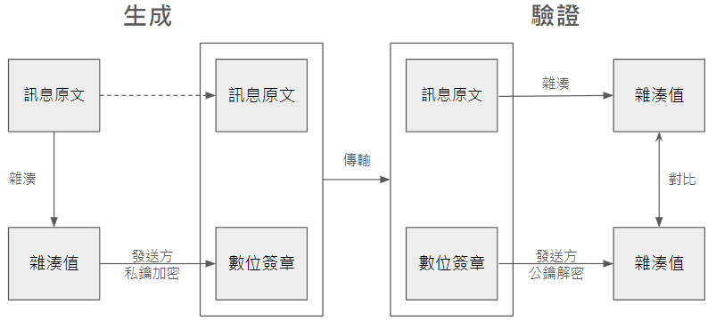
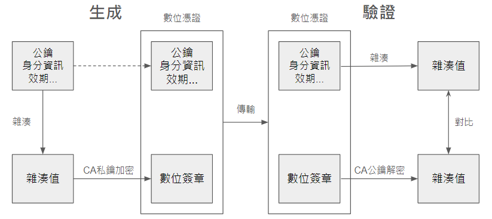
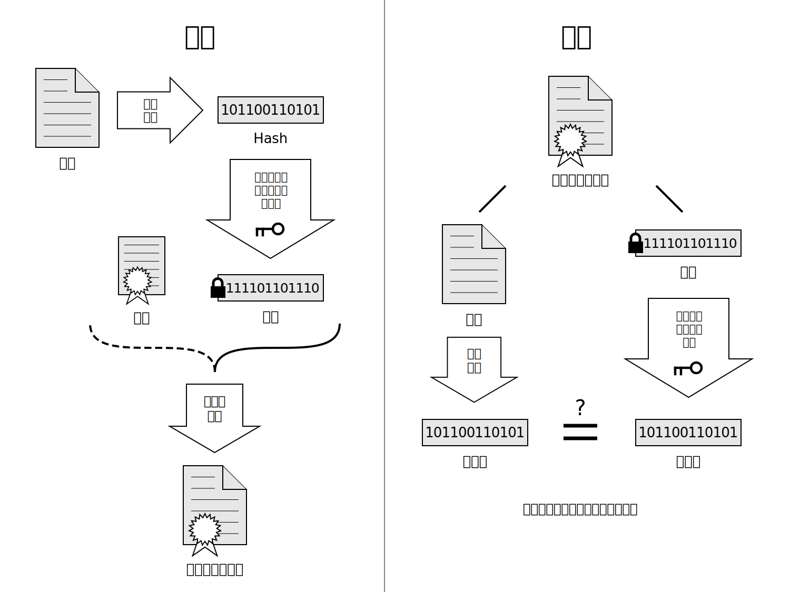
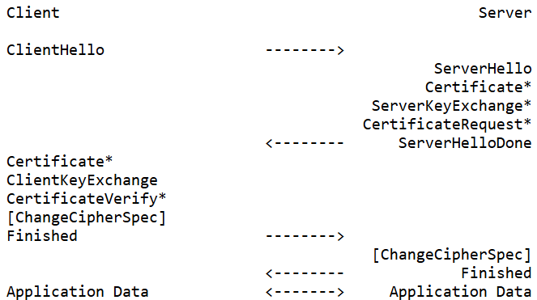

# PKI

**PKI（Public Key Infrastructure，公開金鑰基礎設施）** 是一套管理、發佈、儲存和撤銷數位憑證及公鑰加密技術的系統和技術框架。目的是在網路中提供可靠的身份驗證、數據完整性和加密服務，也 是數位簽章和數位憑證技術的基礎。

## I. PKI 主要組成

<aside>
💡PKI架構示意圖
</aside>

### **1. 憑證授權機構（Certificate Authority, CA）**

- CA 是 PKI 的核心，是一個信任的第三方機構，負責簽發、管理、撤銷數位憑證。
- 會驗證申請者的身份並將公鑰和身份信息綁定到數位憑證上。

### **2. 註冊機構（Registration Authority, RA）**

- RA 是 CA 的輔助機構，在架構中扮演承上啟下的角色，負責驗證用戶身份並向 CA 提交憑證簽發請求。
- 讓 CA 不需要直接與所有用戶進行交互，具有更高的安全性。
    
    
    <aside>
    💡用戶透過 RA 向 CA 申請數位憑證
    </aside>
    
- 功能：
    1. **身份驗證**：
        - RA 的核心職責是對憑證申請者進行身份驗證，包括驗證申請者是否擁有合法的身份檔案、確保他們是憑證所聲明的實體，以及確保憑證的使用是合法的。
    2. **處理數位憑證申請**：
        - 當申請者提交憑證申請時，RA 會審核該申請，並驗證申請者提供的資料是否正確無誤。包括憑證的有效期限、密碼保護和其他相關的資訊
        - 確認身份後，RA 會將申請轉發給 CA 進行數位憑證的簽發。
    3. **協助密鑰生成**：
        - 若用戶不具備生成密鑰對（公鑰與私鑰）的能力，可由 RA 代由生成。
    4. **記錄與管理**：
        - RA 負責記錄所有憑證申請和相關的操作，以便追蹤憑證的使用情況、進行監控並提供後續的審計。
- RA 與 CA 的區別：
    - CA 是最終負責簽發數位憑證的機構，並且具有簽發和吊銷憑證的權力。
    - RA ****則是一個中介機構，專注於驗證申請者的身份。它不具備簽發數位憑證的權限，而是協助 CA 處理和確認憑證申請。

### 3. 數位簽章以及**數位憑證**

- **數位簽章（Digital Signature）**
    - 數位簽章是一種基於加密技術的電子簽名方法，用於驗證電子文件或數據的真實性和完整性。
    - 使用了公鑰加密領域的技術，定義兩種互補的運算，一個用於簽章，另一個用於驗證。
    使用的技術為非對稱加密（如RSA、ECDSA）及 hash 函數（如SHA-256）。
    - 運作流程：
        - **生成簽章**：文件的發送者對於要傳輸的訊息原文進行 hash （雜湊）運算，生成 hash 值，然後使用自己的私鑰對 hash 值進行加密，得到的結果即為數位簽章，接著將文件以及數位簽章發送給接收者。
        - **傳送文件與簽章**：發送者將文件與數位簽章一起發送給接收者。
        - **驗證簽章**：接收者使用發送者的公鑰解密還原 hash 值（下方路徑），並對訊息原文經過 函式計算出 hash 值（上方路徑）。如果兩者的 hash 值一致，則說明文件未被篡改且簽名者的身份有效。
        
        
            <aside>
            💡數位簽章流程示意圖
            </aside>
    
- **數位憑證（Digital Certificate）**
    - 數位憑證是一種電子文件，用於證明一個實體（如個人、組織或伺服器）的身份，並確保該實體的公鑰屬於該實體。
    - 注意：數位憑證是公鑰基礎設施（PKI）中的核心組件！
    - 主要構成包括：
        1. **持有者的身份資訊**：如持有者的名稱、電子郵件地址、組織等。
        2. **持有者的公鑰**：與持有者私鑰對應的公鑰，憑證持有者用於進行加密和簽署數位簽章。
        3. **有效期**：數位憑證通常有一個有效期，過期後需重新申請。
         
            <aside>
            💡數位憑證內容示意圖
            </aside>
    - 運作流程：
        - **申請**：用戶向 CA 提交申請，並提供身份資訊及其公鑰。
        - **驗證身份**：CA 對申請者的身份進行驗證。
        - **簽發**：驗證完成後，CA 簽發數位憑證，其中包含持有者的公鑰及相關資訊。
        - **使用**：憑證持有者在與其他人通信或進行加密操作時，可以提供數位憑證以證明其身份，對方可以使用 CA 的公鑰來驗證憑證的真實性，進而信任持有者的公鑰。
            
            
            <aside>
            💡憑證的申請、發布、使用的簡單示意圖
            </aside>
            

### 4. **公開金鑰與私鑰對**

- PKI 使用非對稱加密技術（Asymmetric cryptography），包括一對密鑰：公鑰和私鑰。公開金鑰可以公開共享，用於加密或驗證數位簽章；私鑰則必須保密，用於解密或簽署數據。
- **公鑰（Public Key）**
    - **用途**：公鑰是公開的，任何人都可以取得。主要用於加密資料或驗證數位簽章。
    - **加密**：當發送方想傳送加密訊息給接收方時，可以使用接收方的公鑰來加密訊息。只有持有對應私鑰的人才能解密這個加密的內容。
    - **驗證數位簽章**：當收到一個數位簽章的文件時，接收方可以用簽署者（發送方）的公鑰來驗證這個簽章是否有效。
- **私鑰（Private Key）**
    - **用途**：私鑰必須保密，不能公開。主要用於解密資料和產生數位簽章。
    - **解密**：當接收方收到一個使用自己的公鑰加密的訊息時，只有接收方（擁有私鑰的人）能用私鑰解密該訊息，確保訊息的機密性。
    - **產生數位簽章**：當發送方想證明自己發送了某個文件或訊息時，發送方可以使用私鑰對該文件進行數位簽章。接收方可以使用發送方的公鑰來驗證這個簽章，從而確保該文件確實由發送方簽署，且未被篡改。

### 5. **憑證吊銷清單（Certificate Revocation List, CRL）**

- 存放在**憑證儲存庫（Certificate Repository）**中，由 **Directory Authority（DA）** 管理
- DA 提供目錄瀏覽服務，負責將 RA 傳過來的使用者資訊以及數位憑證加入到伺服器上
- DA 通常以公開可訪問的形式存在，使用者可以直接透過存取憑證儲存庫來取得其他使用者的公開數位憑證、最新的憑證撤銷清單（CRL）。
- 為了提升效率，可透過 **OCSP（Online Certificate Status Protocol，線上憑證狀態協議）**查詢某個數位憑證的狀態，判斷該憑證是有效，而不須下載整個 CRL。
- OCSP 提供了更靈活、快速的查詢方式，允許即時確認單個憑證的狀態，而不需下載整份 CRL。

### 6. 其他

- 密鑰儲存與管理
    - PKI 需要安全地儲存公私鑰對，並確保私鑰的安全性。也包括密鑰的備份和恢復，以防丟失或損壞。
    - 可透過備用身份驗證程序（電話、視訊等實名認證），用於處理私鑰遺失的情況。
- **VA（Validation Authority，驗證機構）**
    - 專門負責檢查和確認數位憑證有效性的機構。VA 的主要功能是驗證數位憑證是否有效、是否被吊銷，以及確保憑證在通信過程中能夠被信任。
- **Relying Party（RP）**以及 **End Entities（EE）**
    - RP 是信賴 PKI 架構的服務提供者。
    - EE 則為最終使用者，如個人用戶、伺服器、應用程式等。
    
    
    
    <aside>
    💡PKI、RP、EE關係示意圖
    </aside>
    

## II. PKI 運作機制

- 憑證的申請與簽發：
    - 用戶生成密鑰對並向 RA 提交憑證申請。RA **驗證用戶身份後，將請求轉發給 CA。
    - CA 收到申請、並驗證申請者的真實身分後，把申請者的公鑰、身分資訊、憑證的有效期等訊息打包在一起，使用雜湊函式生成雜湊值。最後，CA 使用自己的私鑰對這個雜湊值進行簽署，生成數位簽章。
    - 數位簽章與原始資訊（申請者的公鑰、身分資訊、憑證的有效期等）一起組成完整的數位憑證。
    - CA 簽發憑證並將其發送給用戶和憑證儲存庫。
- 憑證的驗證：
    - 用戶或應用程序在收到數位憑證後，首先檢查憑證的有效性，包括簽發者是否可信、憑證是否在有效期內以及是否被撤銷。
- 簽名與驗證：
    - 由數據發送方用其私鑰簽署數據，接收方使用發送者的公鑰來驗證簽名
    - 接收方收到數位憑證後，首先提取憑證中的數位簽章，使用 CA 的公鑰對數位簽章進行驗證，獲得原始雜湊值。
    - 同時，對數位憑證中的其他內容（公鑰、身分資訊、有效期等，不包括簽章）進行雜湊獲得新的雜湊值，比對兩個雜湊值
    - 若為文件的靜態傳輸、或是持久性的數據傳輸，則通常只需要一次簽名和驗證

## III. PKI 運作流程

- 憑證申請過程：
    1. 使用者申請：
        - 使用者與安全伺服器建立連線；產生自己的公鑰和私鑰，將公鑰和自己的身分資訊提交給安全伺服器，安全伺服器將使用者的申請資訊傳送給 RA 伺服器。
    2. RA 審核：
        - RA 收到使用者的申請，使用者需向 RA 證明自己的身分，RA 進行核對。如果 RA 同意使用者的請求，則對憑證申請資訊做數位簽章；否則拒絕使用者的申請。
    3. CA 核發數位憑證：
        - RA 將使用者的申請內容和數位簽章傳輸給 CA，CA 對簽章做認證，如果驗證通過，則同意使用者請求，並核發數位憑證，然後將數位憑證輸出。如果驗證不通過，則拒絕憑證申請。
    4. RA 轉發數位憑證：
        - RA 從 CA 得到新的數位憑證，首先將憑證輸出到憑證儲存庫，再通知使用者憑證核發成功，告知憑證序號，到指定的網址去驗證憑證。
    5. 使用者取得憑證：
        - 使用者使用憑證序號去指定網址驗證自己的數位憑證，只有持有與申請時提交的公鑰配對的私鑰才能驗證成功。
- 憑證驗證過程：
    1. EE 使用憑證簽章資料：
        - EE（終端實體）使用數位憑證對資料進行 hash 運算產生摘要，然後用其私鑰對該摘要進行簽署，生成簽章值。EE 會將資料、簽章值與數位憑證一起準備好，並交給 RP（依賴方、服務提供者）來要求服務。
    2. RP 收到資料請求：
        - RP 接收到 EE 提交的資料、簽章值以及數位憑證後，將這些資訊傳送給 VA（驗證機構），要求進行數位簽章與數位憑證的驗證。
    3. VA 憑證及簽章驗證：
        - VA 會負責檢查數位簽章的正確性及數位憑證的有效性：
            - 使用 EE 提供的數位憑證的公鑰來驗證簽章值，確認資料是否被篡改。
            - 檢查數位憑證的狀態，確認其有效且未被吊銷，並檢查是否在有效期內。
    4. VA 通知 RP 結果：
        - 數位簽章和數位憑證都驗證完成後，VA 將驗證結果傳回給 RP。
    5. RP 根據結果提供服務：
        - RP 根據 VA 返回的驗證結果來決定是否向 EE 提供服務。如果驗證成功，RP 會繼續提供服務；如果驗證失敗，RP 就會拒絕服務請求。
- 憑證撤銷過程：
    1. 使用者申請：
        - 使用者向 RA 發送一封加密郵件，申請撤銷數位憑證。
    2. RA 審核：
        - RA 同意憑證撤銷後，RA 使用其私鑰對撤銷申請進行數位簽章。
    3. CA 更新：
        - CA 驗證憑證撤銷請求的數位簽章，如果正確則同意申請，更新內部資料庫，同時更新CRL 和 OCSP 響應者的資訊。
    4. 資訊發布：
        - RA 收到更新確認，將新 CRL 發布到憑證儲存庫。
        - OCSP 響應者即時更新，準備回應狀態查詢。
    5. 使用者和系統存取：
        - 使用者可以存取憑證儲存庫下載 CRL。
        - 支援 OCSP 的系統可以即時查詢 OCSP 響應者獲取憑證狀態。
            
            OCSP 響應者：是 PKI 系統中的一個重要組件，負責處理 OCSP（Online Certificate Status Protocol，線上憑證狀態協定）請求。能夠即時提供憑證的狀態信息（有效、已撤銷、未知），比 CRL 更快速。
            

## IV. 憑證類別

- **身份憑證（Identity Certificate）：**
    - 為一般的數位憑證 ，使用 X.509 v3 的格式（所有憑證均使用此格式）。
    
    
    
- **根憑證（Root Certificate）：**
    - 根憑證是一種自簽的憑證（Self-Signed certificate），具有相同的憑證發行者名稱（Issuer Name）與憑證持有者名稱（Subject Name）
    - 由根憑證機構（Root CA）自己的私鑰來簽發根憑證機構自己的公鑰。
    - 沒有上層機構再為其本身作數位簽章，所以都是自簽憑證，擔任**信任鏈**起點（Trust Anchor）的角色。
    - 可利用 Windows 內建之 MMC、或是在指令列輸入 ***certmgr.msc*** 查看
    
    
    
    
    
    

## V. PKI 憑證層級結構和信任鏈

- Root CA（根 CA）：位於層級結構的頂端，包含其公鑰和主體金鑰識別碼（SKI）。根CA的公鑰通常預先安裝在操作系統或瀏覽器中，這些被稱為「信任儲存庫」，操作系統和瀏覽器製造商會仔細審核根CA，只有符合嚴格安全標準的CA才能被納入信任儲存庫。當我們收到一個由CA簽發的憑證時，我們會追溯整個憑證鏈，直到達到根CA。如果這個根CA存在於我們的信任儲存庫中，我們就可以信任整個鏈條。
- Intermediate CA（中間 CA）：由 Root CA 簽發，包含其公鑰、主體金鑰識別碼（SKI）和授權金鑰識別碼（AKI），AKI 與 Root CA 的 SKI 相匹配，建立了與 Root CA 的信任關係
- EE（終端實體）憑證：由 Intermediate CA簽發，包含其公鑰、主體金鑰識別碼（SKI）和授權金鑰識別碼（AKI），AKI 與 Intermediate CA 的 SKI 相匹配，建立了與 Intermediate CA 的信任關係
- 信任鏈：
    - 紅線：從 Root CA 到 Intermediate CA
    - 藍線：從 Intermediate CA 到 EE 憑證
- 金鑰識別碼：
    - SKI（Subject Key Identifier）：識別憑證的公鑰
    - AKI（Authority Key Identifier）：識別簽發此憑證的 CA 公鑰

## VI. PKI 實際應用：SSL／TLS

**SSL（Secure Sockets Layer，安全套接層）** 和 **TLS（Transport Layer Security，傳輸層安全性）** 是用於保障網絡通信安全的加密協議。而 PKI 提供的數位簽章、數位憑證、公私鑰加密技術、身份驗證以及憑證吊銷管理，都是 SSL/TLS 協議能夠保證網路通信安全的基礎。

- **SSL（Secure Sockets Layer，安全套接層）** ： 由 Netscape 開發的早期加密通訊協定，現在已被 TLS 取代。
- **TLS（Transport Layer Security，傳輸層安全性）**：SSL 的繼承者，提供更安全的加密通訊協定。
- 核心概念
    - 資料加密：確保資料在傳輸過程中不被截取或篡改。
    - 身分驗證：確保通訊雙方的可信度。
    - 資料完整性：確保資料在傳輸過程中不被修改。
- 加密方法
    - **對稱加密：**加密和解密使用相同的金鑰（例如：[DES](https://l2x.gitbooks.io/understanding-cryptography/content/docs/chapter-1/des.html) \ [AES](https://l2x.gitbooks.io/understanding-cryptography/content/docs/chapter-1/aes.html)）。
        
        [symmetricEncyrption.avif](static/symmetricEncyrption.avif)
        
    - **非對稱加密：**使用一對公鑰和私鑰進行加密和解密（例如 [RSA](https://l2x.gitbooks.io/understanding-cryptography/content/docs/chapter-3/rsa.html)）。
    
    [asymmetricEncryption.avif](static/asymmetricEncryption.avif)
    

### SSL（安全套接層）

- **SSL 1.0**
    - 描述： 由於嚴重的安全問題，從未公開發佈。
- **SSL 2.0**
    - 改善：
        - 引入了基本的加密機制。
        支援對稱加密和數位憑證。
    - 漏洞：
        - 數個已知的安全漏洞，例如不安全的金鑰交換機制。
        - 不支援訊息驗證碼 (MAC) 以驗證資料完整性。
- **SSL 3.0**
    - 改善：
        - 解決了 SSL 2.0 的多個安全問題，改善了加密算法和通訊協定設計。
        - 引入了更安全的握手過程。
        - 支援訊息驗證碼（MAC），加強資料完整性保護。
    - 漏洞：
        - 儘管安全性有所改善，SSL 3.0 仍有一些問題，例如 [POODLE 攻擊](https://www.acunetix.com/blog/web-security-zone/what-is-poodle-attack/)。

### TLS（傳輸層安全性）

- **TLS 1.0（RFC 2246）**
    - 改善：
        - 增加了對 HMAC （Hash-based Message Authentication Code）的支援。
    - 漏洞：
        - 仍有一些安全問題，例如 [CRIME 和 BEAST 攻擊](https://www.infosecinstitute.com/resources/hacking/beast-vs-crime-attack/)。
- **TLS 1.1（RFC 4346）**
    - 改善：
        - 加入 IV（初始化向量）隨機化，防止封包重放攻擊。
        - 增強對稱加密模式的安全性，支援 AES 加密。
    - 漏洞：
        - 較 TLS 1.0 有所改善，但仍有一些已知的安全風險，例如 [Lucky Thirteen 攻擊](https://medium.com/@c0D3M/lucky-13-attack-explained-dd9a9fd42fa6)。
- TLS 1.2（RFC5246）
    - 改善：
        - 引入了新的訊息驗證演算法（例如 SHA-256）。
        - 支援更強的加密演算法（例如 AES-GCM）。
        - 改良完整性保護機制。
        - 增強了與舊版本的相容性。
    - 漏洞：
        - 雖然 TLS 1.2 提供了許多安全性改進，但仍然面臨一些攻擊威脅，例如 [POODLE 攻擊](https://www.acunetix.com/blog/web-security-zone/what-is-poodle-attack/)。
    - 握手（Handshake）概述：
        
        
        <aside>
        💡TLS 1.2 handshake 流程
        </aside>
        
        1. **ClientHello：** 客戶端向伺服器發送「ClientHello」消息。這個消息包含了 TLS 版本、加密套件（加密算法）、壓縮方法以及客戶端隨機號碼、壓縮方法。
        2. **ServerHello：**伺服器收到「ClientHello」後，會傳回「ServerHello」，表示接受了某個加密套件和 TLS 版本。伺服器也會發送自己的隨機號碼，用來幫助生成密鑰。
        3. **ServerCertificate：**伺服器會將自己的數位憑證發送給客戶端。客戶端可以使用它來驗證伺服器的身份。
        4. **ServerKeyExchange：**如果加密協商中需要額外的密鑰材料（例如 DH 或 ECDH 交換），伺服器就會發送「ServerKeyExchange」消息
        5. **CertificateRequest：**伺服器可以請求客戶端提供自己的數位憑證，以便進行雙向身份驗證。
        6. **ServerHelloDone：**伺服器發送「ServerHelloDone」，表示伺服器已經完成所有初始通信，等待客戶端回應。
        7. **ClientCertificate：**客戶端回應自己的數位憑證。
        8. **ClientKeyExchange：**客戶端生成一個「預先主密金鑰」（pre-master secret），然後用伺服器的公鑰加密，並將它發送給伺服器。
        9. **CertificateVerify：**客戶端發送了自己的憑證後，就會發送「CertificateVerify」，完成身份驗證。
        10. **ChangeCipherSpec**：客戶端通知伺服器使用新的加密方法。
        11. **Finished：**客戶端發送「Finished」，代表整個握手過程已經完成。
        12. **Application Data：**握手完成後，雙方就可以開始加密通信

### TLS 1.3（RFC8446）

- 改善：
    - 簡化了 Handshake 過程，減少了往返次數，提高了性能。
    - 預設為 Perfect Forward Secrecy（PFS）。
    - 移除過時和不安全的加密演算法及通訊協定功能（例如 RC4、MD5、SHA-1）。
    - 強化資料加密與認證，提供更強大的安全保證。
- 漏洞：
    - TLS 1.3 在設計上著重於安全性，目前沒有重大的安全漏洞，但仍會持續檢討與改進。
    - 握手概述：
        
        
        <aside>
        💡TLS 1.3 handshake 流程
        </aside>
        
    1. **ClientHello：**內容新增了密鑰交換算法（如 key_share）、PSK 模式等。
    2. **ServerHello：**伺服器提供自己的 key_share 和 PSK 信息，並加入了加密擴展。
    3. **EncryptedExtensions**：伺服器發送加密的擴展信息，進行更多的加密配置。
    4. **Certificate 和 CertificateVerify**
    5. **Finished**

## VII. OpenZiti TLS Simulation

temp