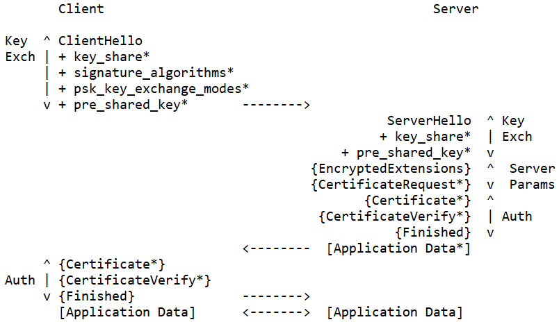

# SSL-TLS-OpenZiti-Encryption-Study

## Index

[Abstract](#abstract)

[Basic Concept](#basic-concept)

[Encryption Method](#encryption-method)

[SSL (Secure Sockets Layer)](#ssl-secure-sockets-layer)

[TLS (Transport Layer Security)](#tls-transport-layer-security)

[Ziti's Data Encryption and Decryption](#zitis-data-encryption-and-decryption)

[Reference](#reference)

## Abstract

In advance, I will give a basic introduction on the historical development of SSL and TLS and their significance in network security.

Then, I will demonstrate a simple ziti's data encryption and decryption simulation.

## Basic Concept

### Introduction

+ SSL (Secure Sockets Layer): An early encryption protocol developed by Netscape, which has now been replaced by TLS.
+ TLS (Transport Layer Security): The successor to SSL, providing a more secure encryption protocol.

### Core Concepts

+ Encryption: Ensures that data is not intercepted or altered during transmission.
+ Authentication: Ensures the trustworthiness of the communicating parties.
+ Data Integrity: Ensures that data is not modified during transmission.

## Encryption Method

### Symmetric and Asymmetric Encryption

+ Symmetric Encryption: Uses the same key for both encryption and decryption (e.g., [DES](https://l2x.gitbooks.io/understanding-cryptography/content/docs/chapter-1/des.html) \ [AES](https://l2x.gitbooks.io/understanding-cryptography/content/docs/chapter-1/aes.html)).
  
+ Asymmetric Encryption: Uses a pair of public and private keys for encryption and decryption (e.g., [RSA](https://l2x.gitbooks.io/understanding-cryptography/content/docs/chapter-3/rsa.html)).
  

### Key Exchange

+ Key Exchange Protocol: Ensure secure exchange of symmtric encryption key (e.g., [Diffie-Hellman](https://developer.aliyun.com/article/952796)).

---

## SSL (Secure Sockets Layer)

### SSL 1.0

+ Description: Never publicly released due to serious security issues.

### SSL 2.0

+ Improvements:
  + Introduced basic encryption mechanisms.
Supported symmetric encryption and digital certificates.
+ Vulnerabilities:
  + Several known security vulnerabilities, such as insecure key exchange mechanisms.
  + Did not support Message Authentication Codes (MACs) to verify data integrity.

### SSL 3.0

+ Improvements:
  + Addressed multiple security issues from SSL 2.0, improving encryption algorithms and protocol design.
  + Introduced a more secure handshake process.
  + Supported Message Authentication Codes (MACs), enhancing data integrity protection.
+ Vulnerabilities:
  + Despite improvements in security, SSL 3.0 still had some issues, such as the [POODLE attack](https://www.acunetix.com/blog/web-security-zone/what-is-poodle-attack/).

## TLS (Transport Layer Security)

### TLS 1.0 (RFC 2246)

+ Improvements:
  + Added support for HMAC (Hash-based Message Authentication Code).
+ Vulnerabilities:
  + Still had some security issues, such as the [CRIME and BEAST attacks](https://www.infosecinstitute.com/resources/hacking/beast-vs-crime-attack/).

### TLS 1.1 (RFC 4346)

+ Improvements:
  + Prevented packet replay attacks by adding IV (Initialization Vector) randomization.
  + Enhanced security for symmetric encryption modes, supporting AES encryption.
+ Vulnerabilities:
  + Improved over TLS 1.0 but still had some known security risks, such as the [Lucky Thirteen attack](https://medium.com/@c0D3M/lucky-13-attack-explained-dd9a9fd42fa6).

### TLS 1.2 (RFC5246)

+ Improvements:
  + Introduced new message authentication algorithms (e.g., SHA-256).
  + Supported stronger encryption algorithms (e.g., AES-GCM).
  + Improved integrity protection mechanisms.
  + Enhanced compatibility with older versions.
+ Vulnerabilities:
  + Although TLS 1.2 provided many security improvements, it still faced some attack threats, such as the [POODLE attack](https://www.acunetix.com/blog/web-security-zone/what-is-poodle-attack/).
+ Handshake Overview:
  
  1. **ClientHello**: TLS version, cipher suite, client random number, compression method.
  2. **ServerHello**: TLS version, cipher suite, server random number, additional information.
  3. **ServerCertificate**: Certificate, public key(RSA).
  4. **ServerKeyExchange**: Public key(DH), parameter(DH).
  5. **CertificateRequest**: Optional.
  6. **ServerHelloDone**: Ending mark.
  7. **ClientCertificate**: Certificate(if requested by server), public key.
  8. **ClientKeyExchange**: Pre-master secret key(RSA, encrypted by server's public key), public key(DH).
  9. **CertificateVerify**: Verify possession of the private key in the certificate.
  10. **ChangeCipherSpec**: Use new encryption method.
  11. **Finished**: Ending mark.

### TLS 1.3 (RFC8446)

+ Improvements:
  + Simplified the handshake process, reducing round trips and improving performance.
  + Defaulted to Perfect Forward Secrecy (PFS).
  + Removed outdated and insecure encryption algorithms and protocol features (e.g., RC4, MD5, SHA-1).
  + Enhanced data encryption and authentication, providing stronger security assurances.
+ Vulnerabilities:
  + TLS 1.3 was designed with a focus on security, and currently has no major security vulnerabilities, though it continues to be reviewed and improved.
+ Handshake Overview:
  

---

## Ziti's Data Encryption and Decryption

Click here: [Model Description](ziti/README.md)

Click here: [Model Simulation](simulation/README.md)

---

## Reference

[Transport Layer Security](https://en.wikipedia.org/wiki/Transport_Layer_Security)

[Secure101](https://simular.co/blog/post/21-%E4%B8%80%E7%AF%87%E6%96%87%E7%AB%A0%E7%9C%8B%E6%87%82%E4%BB%80%E9%BA%BC%E6%98%AFssl)

[SSL/TLS and PKI History](https://www.feistyduck.com/ssl-tls-and-pki-history/)

[RFC5246](https://www.rfc-editor.org/rfc/rfc5246)

[RFC8446](https://www.rfc-editor.org/rfc/rfc8446)

[ChatGPT](https://openai.com/chatgpt/)
