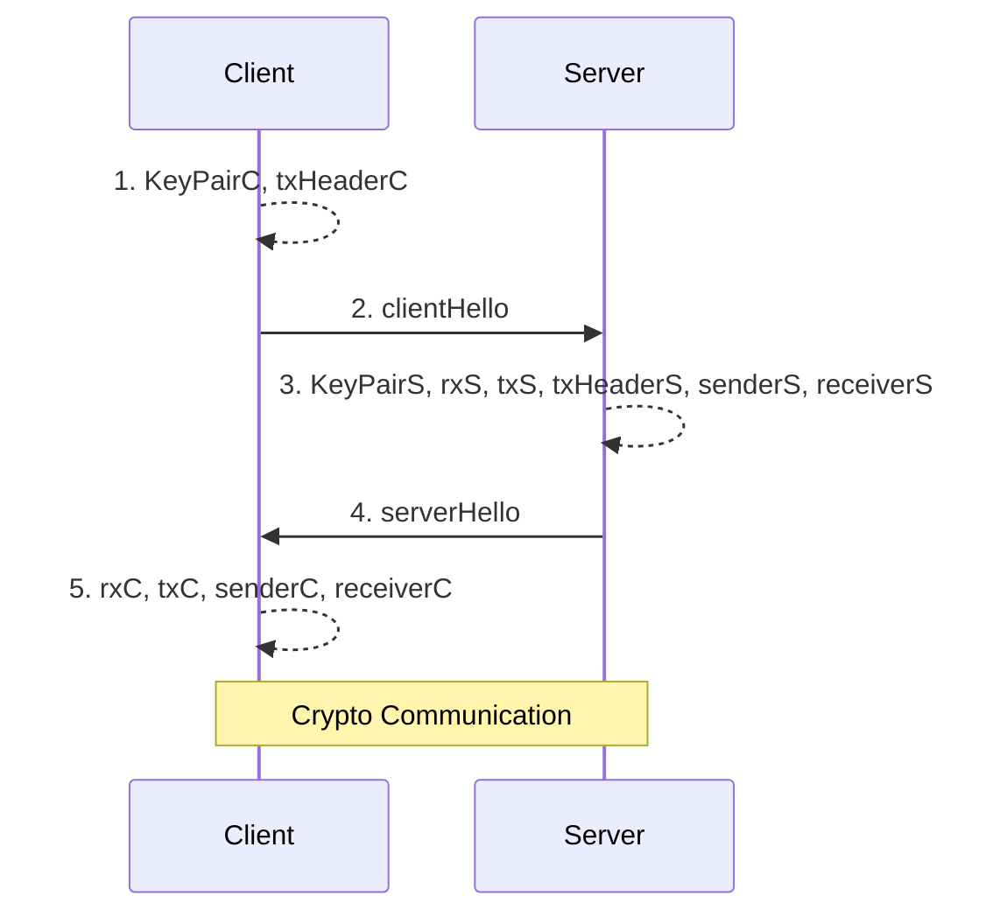
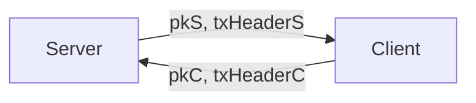
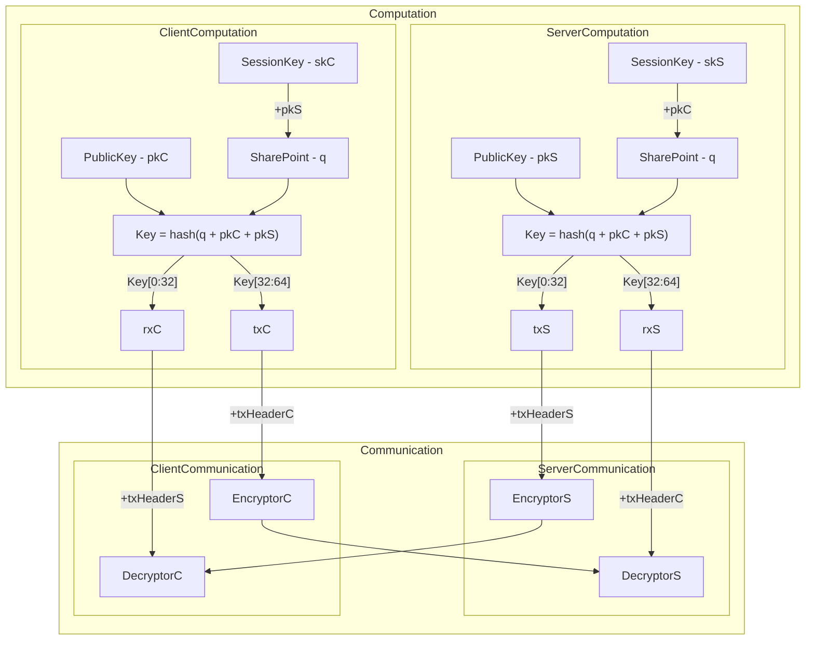

# Ziti's Model Simulation

## Env

|-|Version|
|-|-|
|Ubuntu|22.04.4 LTS|
|Golang|go1.22.5 linux/amd64|

## Sequence Diagram



## Crypto Model - Base Curve25519

### Prep: Exchange Public Key and txHeader



### Crypto



+ Keypoint:
  + The two SharePoints, q, in both ServerComputation and ClientComputation are the same.
  + Since q is the same, it fllows that the Keys in both side, which are derived from hash q + pkC + pkS, are also the same.
  + And also, txS(Key[0:32]) is same as rxC(Key[0:32]). They will plus txHeaderS to make cryptor. So, DecryptorC can decrypt the cipher from EncryptorS.
  + By the same reasoning, DecryptorS can decrypt the cipher from EncryptorC.

## Demo

### Server

Path: SSL-TLS-OpenZiti-Encryption-Study/simulation/server

Run:

```bash
    go test
```

### Client

Path: SSL-TLS-OpenZiti-Encryption-Study/simulation/client

Run:

```bash
    go test
```

### ScreenShots


+ Description:
  + The client will encrypt the string "simulation" and send its ciphertext to the server.
  + The server will receive the ciphertext, decrypt it, reverse the plaintext, and then encrypt the reversed plaintext before sending it back to the client.
  + The client will receive the ciphertext, decrypt it, and obtain the correct plaintext "noitalumis".

## Reference

[Openziti: sdk-golang](https://github.com/openziti/sdk-golang)

[Openziti: secretstream](https://github.com/openziti/secretstream)

[Golang Package](https://pkg.go.dev/)
