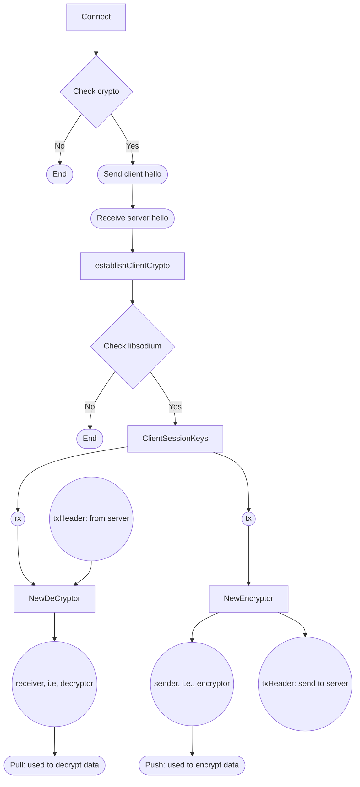

# Ziti's Data Encryption and Decryption

The model seems like TLS 1.3 with using [X25519](https://blog.sww.moe/post/x25519/), but without certificate, i.e., only focus on key exchange and cryption without authentication.

This model is only from the client aspect and also just an outline; the more precise crypto-model should be moved to [simulation/README.md](../simulation/README.md) for review.

## Flow Chart

## [Handshake](handshake.md)

### Connect

1. In connect function, we first check if it needs "crypto" and extract its public key.
2. And, we send the first "hello" message including public key and some configs to peer endpoint.
3. Then, we get the peer side public key from reply message.
4. Finally, it's time to estblish client crypto, i.e., call the "[establishClientCrypto](#establishclientcrypto)" function.

### establishClientCrypto

1. Check if it is based on "libsodium"; otherwise, break it.
2. Use session key and peer key and call the "[ClientSessionKeys](#clientsessionkeys)" function to make the session key: rx(decrypt received data), tx(encrypt sent data).
3. Create an "encryptor" as "conn.sender" which is used to encrypt and send data.
4. Then, we need to send "txHeader" to peer side for secretstream initialization.
5. Finally, we will use this sender to send data and use rx to make a decryptor which is used to decrypt message.

### ClientSessionKeys

1. At first, we use curve25519 to compute a "share secret point".
2. Use blake2b to initialize a hash function.
3. Then, write the share secret key, client's and server's public key to this hash function.
4. In the end, we can calculate the rx and tx via the hash function with three keys.

## [Encrypt](encrypt.md)

### Write

1. Push data into the conn.sender(an ecryptor) and write the ciphertext into message channel.

### Read

1. Pull data from the conn.receiver(a decryptor) and get the plaintext.

## [KeyPair](keypair.md)

The main idea is computing rx and tx session keys under curve25519.

### KeyPair

1. The KeyPair struct is consist a "publicKey" and a "sessionKey".

### NewKeyPair

1. Used to make a new KeyPair.

### (Client/Server)SessionKeys

1. It will return rx and tx which will used in making decryptor and encryptor.

---

## Reference

[Openziti: sdk-golang](https://github.com/openziti/sdk-golang)

[Openziti: secretstream](https://github.com/openziti/secretstream)

[ChatGPT](https://openai.com/chatgpt/)
